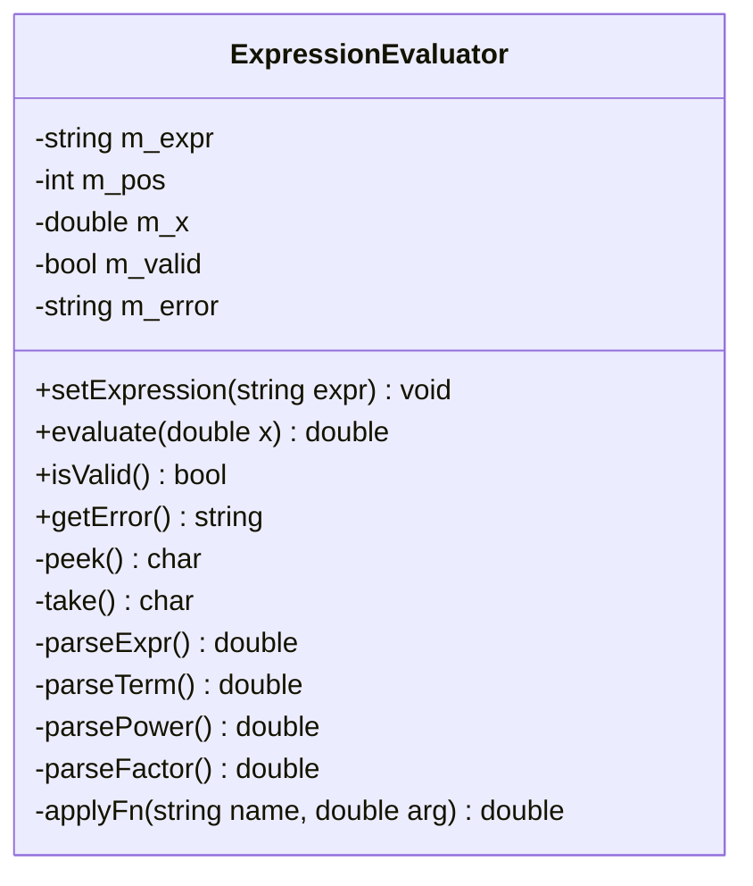
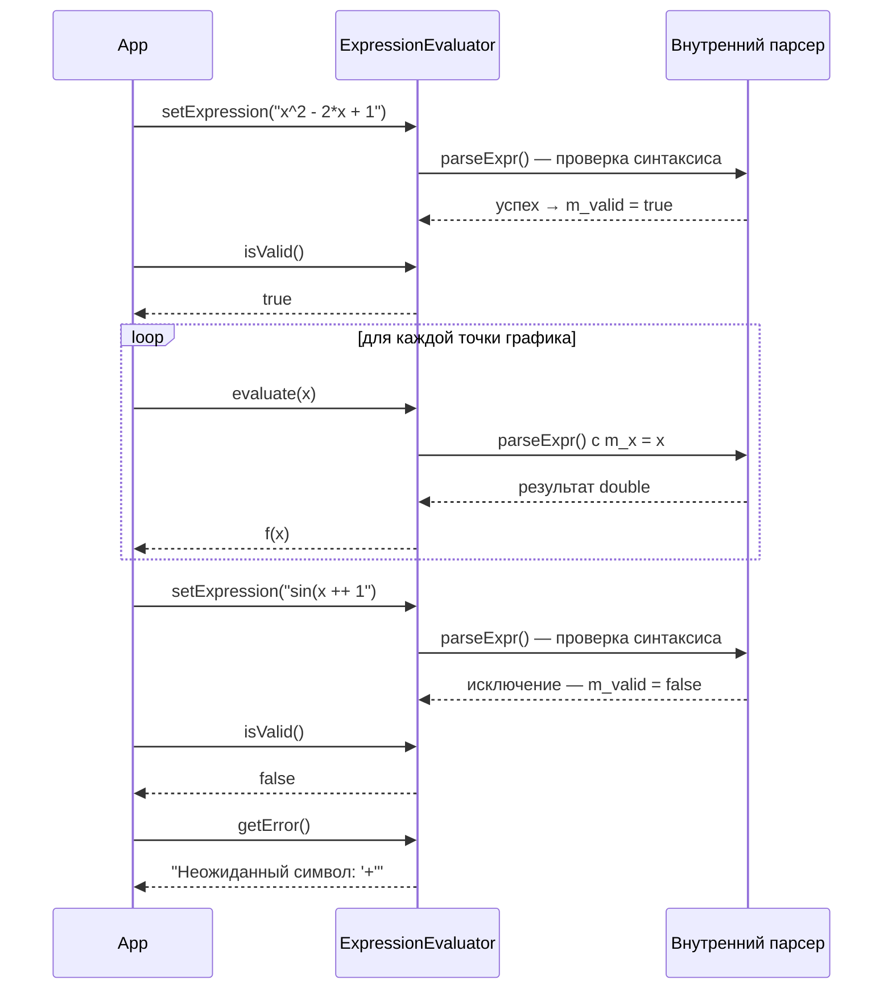

# UML — ExpressionEvaluator

Класс из `src/main.cpp`. Чистый C++17, без зависимостей от Qt.

---

## Диаграмма классов

---

## Схема рекурсивного парсера

Показывает, как `evaluate()` разбирает выражение по приоритету операций.

```mermaid
flowchart TD
    A([evaluate&#40;x&#41;]) --> B[parseExpr]

    B -->|"слагаемые через + / -"| C[parseTerm]
    B -->|"пока есть + или -"| B

    C -->|"множители через * / /"| D[parsePower]
    C -->|"неявное умножение 2x"| D
    C -->|"пока есть * или /"| C

    D -->|"основание"| E[parseFactor]
    D -->|"если есть ^"| D2[parsePower рекурсивно]
    D2 -.->|правый операнд| E

    E --> F{Что за символ?}

    F -->|"цифра / точка"| G["число (stod)"]
    F -->|"минус / плюс"| H["унарный знак → parseFactor"]
    F -->|"скобка ("| I["parseExpr → ожидаем )"]
    F -->|"буква"| J{Что за имя?}

    J -->|x| K[вернуть m_x]
    J -->|pi| L[вернуть M_PI]
    J -->|e| M[вернуть M_E]
    J -->|"функция + ("| N[applyFn]

    N --> O["sin / cos / tan\nsqrt / log / ln\nexp / abs"]
```

---

## Жизненный цикл объекта

